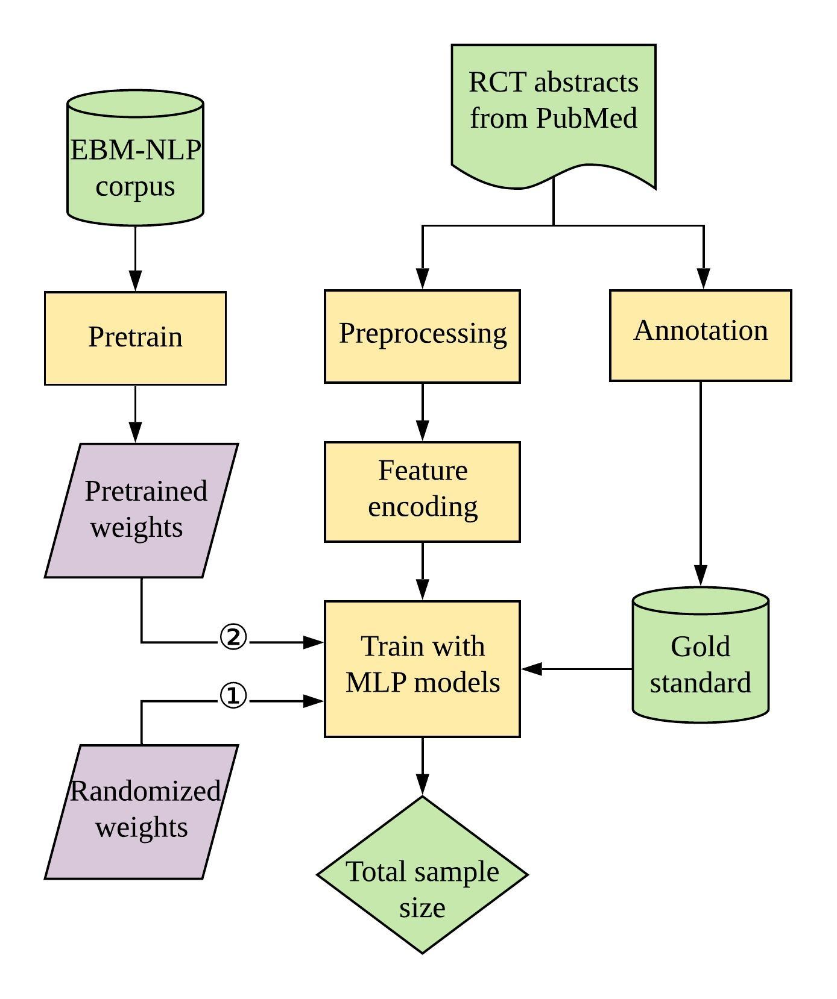

# Sample_Size_Extractor

by Fengyang Lin, Hao Liu, Paul Moon, Chunhua Weng

Sample_Size_Extractor is a Python tool to report total sample size directly from any RCT abstracts. We design the extractor using a combination of syntactic and machine learning methods, and evaluate it on 300 Covid-19 abstracts (Covid-Set) and 100 generic RCT abstracts (General-Set). We also provide a transfer-learning method for this task by pretraining with the large annotated dataset EBM-NLP. The annotated dataset and trained model are shared.

The workflow of our Sample Size Extractor is shown as below:



We provided two options for the initialized weights for models: 1) randomized weights, 2) weights from pretraining on the EBM-NLP corpus.


## Requirements
1) Ensure that you have a working version of **Python 3**.
2) Ensure you have **Tensorflow2** installed and **Keras** could be imported. 
    ```angular2
    pip install tensorflow
    ```
3) Ensure you have **spacy** installed:
    ```angular2
    pip install -U spacy
    python -m spacy download en_core_web_sm
    ```
4) Ensure you have **gensim** installed:
    ```angular2
    pip install gensim
    ```

5) Download word vectors using Word2vec for PubMed [PubMed-w2v.bin](http://evexdb.org/pmresources/vec-space-models/).
The word vectors are available for download from the following link: http://evexdb.org/pmresources/vec-space-models/.
Save the vectors in the root directory. 

Other useful packages (not necessary for using our sample size extractor, but are useful for the task. Examples are demonstrated in notebooks): 

6) Entrez
    ```angular2
    pip install biopython 
    ```

7) word2number
    ```angular2
    pip install word2number
    ```

## How to use it
1) Install the required packages and vectors as above.
2) Run the program.
```angular2
cd Sample_Size_Extractor
python main.py
```
See [Sample_Size_Extractor.ipynb](Sample_Size_Extractor.ipynb) to learn how to use this tool in details.
[Prepare_data_from_ann.ipynb](Prepare_data_from_ann.ipynb) and [Evaluation.ipynb](Evaluation.ipynb) also demonstrated examples on how to prepare your annotated data for training and evualtion.

## Format of input and output

To use the extractor, the input file should be a dataframe and contain at least two columns: `pmid`(int or str), `abstract`(str). Here is an example of the input data.

pmid | abstract
------------ | -------------
33607104 | TITLE: No clinical benefit of high dose corticosteroid administration in patients with COVID-19: A preliminary report of a randomized clinical trial. The aim of this study was to evaluate the clinical effects of dexamethasone administration in patients with mild to moderate acute respiratory distress syndrome (ARDS) due to coronavirus disease 2019 (COVID-19). The study included 50 patients who were randomly assigned to the dexamethasone group or control group. Dexamethasone was administered at a dose of 20mg/day from day 1-5 and then at 10mg/day from day 6-10. The need for invasive mechanical ventilation, death rate, duration of clinical improvement, length of hospital stay, and radiological changes in the computed tomography scan were assessed. The results revealed that 92% and 96% of patients in the dexamethasone and control groups, respectively, required noninvasive ventilation (P=0.500). Among them, 52% and 44% of patients in the dexamethasone and control groups, respectively, required invasive mechanical ventilation (P=0.389). At the end of the study, 64% of patients in the dexamethasone group and 60% of patients in the control group died (P=0.500); the remaining patients were discharged from the hospital during the 28-day follow-up period. The median length of hospital stay was 11 days in the dexamethasone group and 6 days in the control group (P=0.036) and the median length of hospital stay was 7 days in the dexamethasone group and 3 days in the control group (P<0.001). No significant differences were observed in the other outcomes. This study showed that corticosteroid administration had no clinical benefit in patients with COVID-19-induced mild to moderate ARDS.


Output of our extractor:
 
pmid | pred_ss | conf
------------ | -------------| -------------
33607104 | 50 | 0.60276401

`pred_ss`(int) is the extracted total sample size for the given abstract, and `conf` represents the confidence of the extraction.
When confidences for all numbers in the abstract are lower than the defined threshold (default=0.2, you could adjust the threshold later), no sample size will be reported.

## References
1) Words Embedding using Word2vec for PubMed, a pre-trained embedding over a large amount of biomedical scientific literature from PubMed:
    
    *S. Moen and T.S.S. Ananiadou, Distributional semantics resources for biomedical text processing, Proceedings of LBM (2013), 39-44.*
2) The EBM-NLP corpus used in pretraining: 
    
    *B. Nye, J. Jessy Li, R. Patel, Y. Yang, I.J. Marshall, A. Nenkova, and B.C. Wallace, A Corpus with Multi-Level Annotations of Patients, Interventions and Outcomes to Support Language Processing for Medical Literature, Proc Conf Assoc Comput Linguist Meet 2018 (2018), 197-207.*
3) Some utils functions are developed based on [RobotReviewer](https://github.com/ijmarshall/robotreviewer) /Trialstreamer:
    
    *I.J. Marshall, J. Kuiper, and B.C. Wallace, RobotReviewer: evaluation of a system for automatically assessing bias in clinical trials, Journal of the American Medical Informatics Association 23.1 (2016), 193-201.*
    
    *I.J. Marshall, B. Nye, J. Kuiper, A. Noel-Storr, R. Marshall, R. Maclean, F. Soboczenski, A. Nenkova, J. Thomas, and B.C. Wallace, Trialstreamer: A living, automatically updated database of clinical trial reports, J Am Med Inform Assoc 27 (2020), 1903-1912.*
